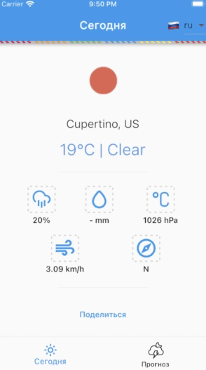

# flutter_weather_app


### О проекте
---

Приложение для отображения погоды.

### Возможности
---

- Open Weather Map API (http://openweathermap.org/api)
- Вкладка для прогноза погоды на 5 дней с интервалом в 3 часа
- Обработка состояний приложения (отсутствие сети, загрузка)
- Архитектура состояния Flutter BLoC, Provider
- Архитектура приложения Clean architecture
- Адаптивный дизайн
- Поддержка iOS и Android
- Min API Level: 21 and iOS 11
- Определение геолокации текущего положения устройства
- Поделиться текущий погодой через мессенджеры
- Смена языка

### Пример поделиться погодой
---

```
Flutter Weather App

city: Gomel, BY
temperature: 7 °C
weather: Clear
wind speed: 9.0, meter/sec
humidity: 57, %
wind degrees: S/SW
pressure: 1000, , hPa
rain: -, mm
```

### Демо
---
         

### Скриншоты
---

            

    


### Локализция
---

- Для локализаии используется библиотека `intl`

- Конфигурация локализации
```
l10n.yaml
```

- Новые строки добавляются в json
```
lib/src/ui/shared/localization/arb/app_en.arb
lib/src/ui/shared/localization/arb/app_ru.arb
```

- Выполнить flutter pub get. Сгенерируются новые файлы по пути
```
.dart_tool/flutter_gen/gen_l10n/app_localizations_ru.dart
```

- В проблемах может отобразиться, что файлы локализации не найдены. Для исправления нужно перезапустить IDE.

- Для использования значений локализации импортировать файл 
```
import 'package:flutter_gen/gen_l10n/app_localizations.dart';
```

- Выбрать нужный текст
```
AppLocalizations.of(context)?.today ?? ''
```