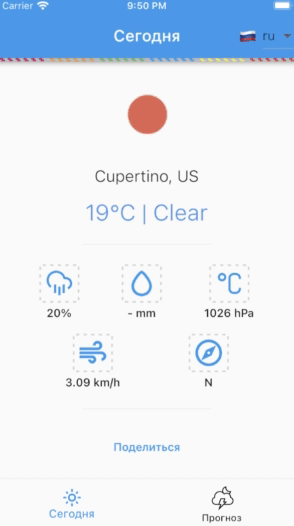

# flutter_weather_app

<p align="center">
  
</p>

Приложение для отображения погоды.

Погода
- Получение погоды из Open Weather Map API (http://openweathermap.org/api)
- Погода сегодня
- Прогноз погоды на 5 дней с интервалом в 3 часа
- Определение геолокации устройства для отображения погоды
- Поделиться текущей погодой через мессенджеры
- Погода кэшируется при первом запуске и больше нет лишних обращений на сервер. Возможно обновление погоды вручную. 

Локализация
- Используется библиотека `intl`
- Поддержка `ru` и `en` локализации
- Определение языка устройства
- Смена языка

Адаптивность
- Отображение бокового меню

Архитектура
- Архитектура приложения Clean architecture
- Архитектура состояния Flutter BLoC, Provider

### Пример поделиться текущей погодой
---

```
Flutter Weather App

city: Gomel, BY
temperature: 7 °C
weather: Clear
wind speed: 9.0, meter/sec
humidity: 57, %
wind degrees: S/SW
pressure: 1000, , hPa
rain: -, mm
```

### Демо
---
         

### Скриншоты
---

            

    

### Как добавить новую локализацию
---

<p align="center">
  
</p>

- Конфигурация локализации
```
l10n.yaml
```

- Новые строки добавляются в json
```
lib/src/ui/shared/localization/arb/app_en.arb
lib/src/ui/shared/localization/arb/app_ru.arb
```

- Выполнить flutter pub get. Сгенерируются новые файлы по пути
```
.dart_tool/flutter_gen/gen_l10n/app_localizations_ru.dart
```

- В проблемах может отобразиться, что файлы локализации не найдены. Для исправления нужно перезапустить IDE.

- Для отсутствующего AppLocalizations импортировать 
```
import 'package:flutter_gen/gen_l10n/app_localizations.dart';
```

- Выбрать текст
```
import '../../shared/localization/extensions/l10n_extension.dart';
```

```
context.l10n?.today ?? ''
```